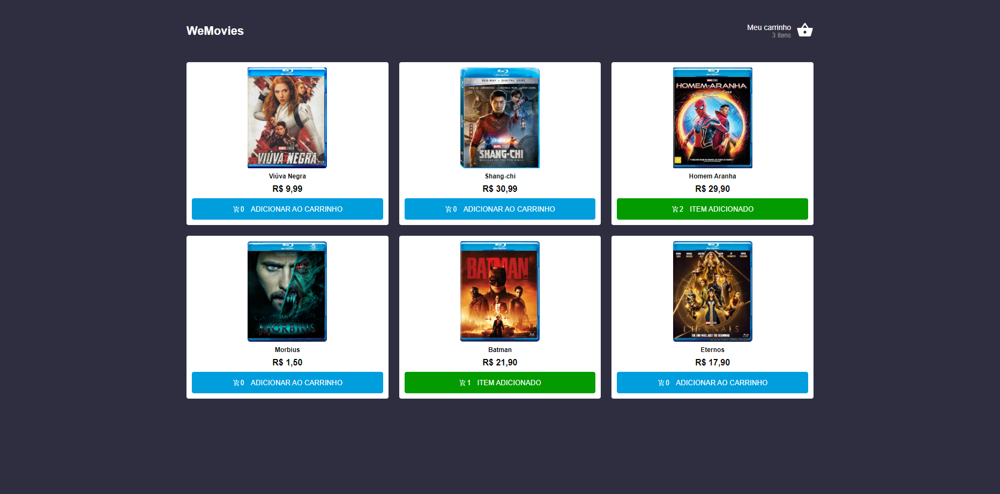
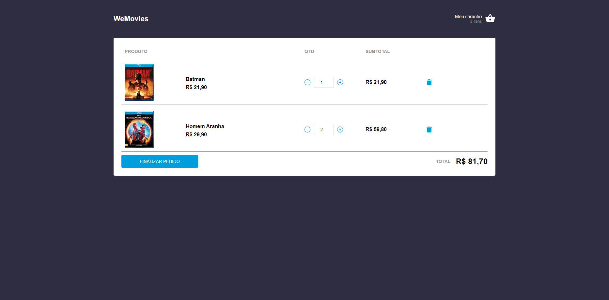
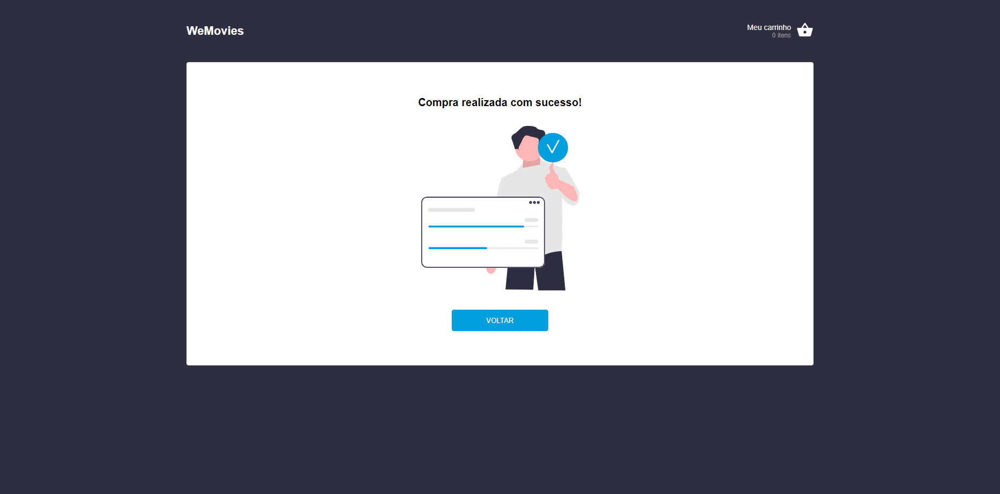

# WeMovies

## Descrição
O projeto proposto é um aplicativo React baseado em TypeScript, integrando a arquitetura de gerenciamento de estado Redux para criar um pequeno commerce de filmes. Este commerce possui funcionalidades como navegação de filmes, um carrinho de compras e a capacidade de finalizar uma compra (sem a implementação de uma tela de pagamento).

## Rodando o projeto
O script de start irá iniciar tanto o aplicativo quanto o servidor json de conteudo:

```bash
$ yarn start
```

Pode iniciar somente a aplicação react:

```bash
$ yarn start-app
```

## Stack utilizada
ReactJS, Typescript, Redux, Styled Components, Axios

<div style="display: flex; justify-content: space-between; margin-bottom:1rem;">
  
  
</div>


